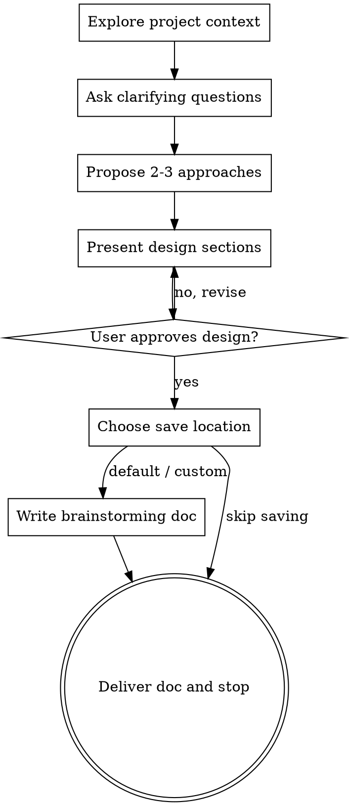

# Brainstorming Ideas Into Designs

## Overview

Turn ideas into clear, approved brainstorming documents through collaborative dialogue.

Always support role-based brainstorming:
- If the user specifies a role, follow that role's perspective (for example: PM, frontend architect, backend architect, UX designer).
- If no role is specified, use the `general strategist` role.

<HARD-GATE>
Do NOT invoke any implementation skill, write any code, scaffold any project, or take any implementation action until you have presented the design and the user has approved it.
</HARD-GATE>

## Anti-Pattern: "This Is Too Simple To Need Design"

Every project must follow this process, even for small changes.
The design can be short for simple ideas, but it still must be presented and approved.

## Checklist

You MUST complete these items in order:

1. Explore project context: inspect files, docs, and recent commits.
2. Ask clarifying questions: one question per message.
3. Propose 2-3 approaches: include trade-offs and recommendation.
4. Present design sections: architecture, components, data flow, error handling, testing; get user approval section by section.
5. Write brainstorming doc: ask for save location choice (default / custom / skip saving) before writing.
6. Stop after delivering the brainstorming doc: do not transition to implementation planning.

## Process Flow

Terminal state is `Deliver doc and stop`.
Do NOT invoke writing-plans or any implementation skill afterward.

## Save Location Rule (Required)

Before any file write, always ask the user to choose:
1. Default directory: `docs/brainstorming/`
2. Custom directory: user-provided path
3. Skip saving: do not write any file

If the user chooses default, use:
- `docs/brainstorming/YYYY-MM-DD-<topic>-brainstorming.md`

If the user chooses custom, write to the exact directory they provide with the same filename pattern.

If the user chooses skip saving, do not write any file — output the doc content inline in the chat only.

## Questioning Rules

- Ask only one question per message.
- Prefer multiple-choice questions where possible.
- Focus on purpose, constraints, and success criteria.
- Go back and re-clarify when responses are ambiguous.

## Design Presentation Rules

- Present 2-3 approaches before finalizing.
- Lead with the recommended option and explain why.
- Keep each section concise for simple tasks and detailed for complex tasks.
- Ask for approval after each section.

## Doc Content Guidelines

Include:
- Role used for brainstorming (explicit role or `general strategist`)
- Problem statement and goals
- Constraints and assumptions
- Candidate approaches with trade-offs
- Recommended design
- Risks and mitigations
- Validation/test strategy
- Open questions (if any)

Do not include implementation code.

## Completion Criteria

Only finish when:
1. The user has approved the design.
2. The user has chosen default, custom, or skip saving for the doc.
3. The brainstorming doc has been written to file (default/custom) or output inline (skip saving), and shared.
